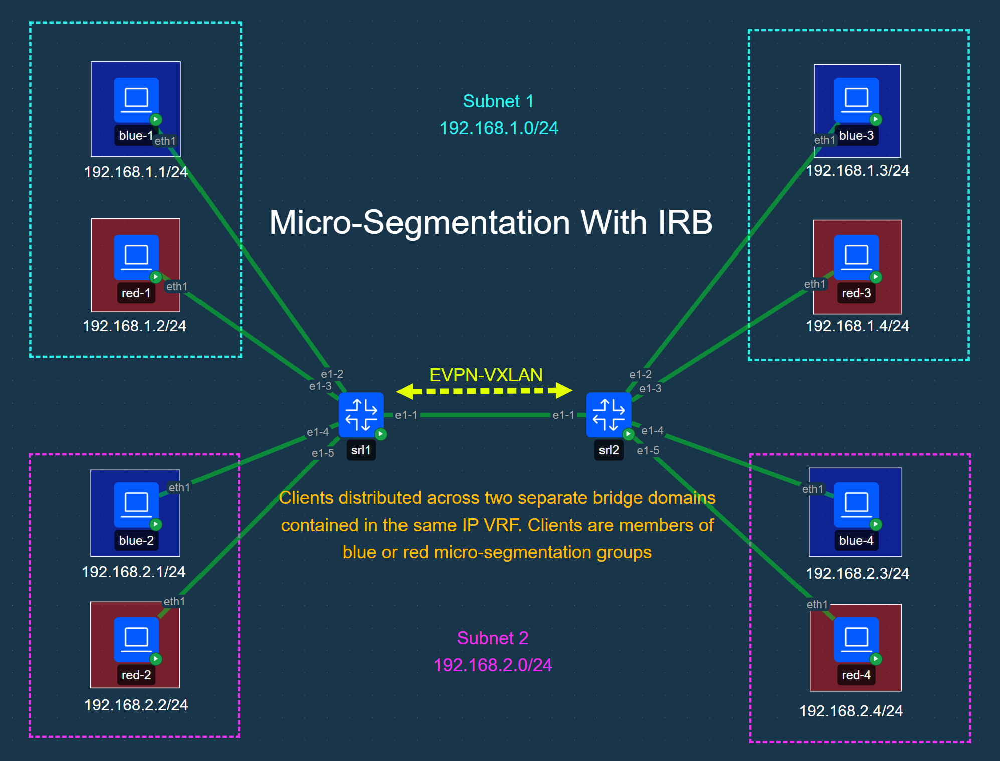

# SR Linux Micro-Segmentation With IRB Lab

## Topology


## Lab Description
This lab demonstrates SR Linux microsegmenation capabilities. The lab consists of two SR Linux switches with EVPN between them. There are eight client devices divided between two stretched vlans within the same IP VRF. The client devices are further micro-segmented into "blue" and "red" groups allowing the user to test micro-segmentation. The groups are defined through static interface membership and group ID numbers are shared via EVPN using Group Based Policy tags.

In this lab we validate micro-segmentation permit and deny in the following cases:

- Inter-Vlan on the same switch
- Intra-Vlan across EVPN
- Inter-Vlan across EVPN


**Host Info**

| SR Linux Credentials | |
|---|---|
| Username | `admin` |
| Password | `NokiaSrl1!` |

| Client  | Connected Switch | Bridge Domain | IP Address  |
| ------- | ---------------- | ------------- | ----------- |
| blue-1  | srl1             | subnet1       | 192.168.1.1 |
| red-1   | srl1             | subnet1       | 192.168.1.2 |
| blue-2  | srl1             | subnet2       | 192.168.2.1 |
| red-2   | srl1             | subnet2       | 192.168.2.2 |
| blue-3  | srl2             | subnet1       | 192.168.1.3 |
| red-3   | srl2             | subnet1       | 192.168.1.4 |
| blue-4  | srl2             | subnet2       | 192.168.2.3 |
| red-4   | srl2             | subnet2       | 192.168.2.4 |


> [!IMPORTANT]
> Containerlab's automatic copying of SSH keys does not work for this lab. This lab uses the `set / platform resource-management group-based-policy lpm-source-lookup true` feature. This feature must be enabled at device boot time and if enabled after requires a restart to take effect. Due to Containerlab's method of apply text / command-style startup configs as if typed into the terminal of the device, using a partial or complete startup-config in text / command format would never enable this feature as every boot would yield a state requiring a reboot to take effect. In order to boot with the feature fully enabled a full JSON-formatted startup-config is used which is processed as a normal startup-config would. The trade-off is the SSH key copying is not performed with this startup-config method and the user must enter the password to log in.


## Containerlab Deployment

```
╭────────┬───────────────────────────────────────────┬─────────┬───────────────────╮
│  Name  │                 Kind/Image                │  State  │   IPv4/6 Address  │
├────────┼───────────────────────────────────────────┼─────────┼───────────────────┤
│ blue-1 │ linux                                     │ running │ 172.20.20.10      │
│        │ ghcr.io/srl-labs/network-multitool:latest │         │ 3fff:172:20:20::a │
├────────┼───────────────────────────────────────────┼─────────┼───────────────────┤
│ blue-2 │ linux                                     │ running │ 172.20.20.4       │
│        │ ghcr.io/srl-labs/network-multitool:latest │         │ 3fff:172:20:20::4 │
├────────┼───────────────────────────────────────────┼─────────┼───────────────────┤
│ blue-3 │ linux                                     │ running │ 172.20.20.2       │
│        │ ghcr.io/srl-labs/network-multitool:latest │         │ 3fff:172:20:20::2 │
├────────┼───────────────────────────────────────────┼─────────┼───────────────────┤
│ blue-4 │ linux                                     │ running │ 172.20.20.9       │
│        │ ghcr.io/srl-labs/network-multitool:latest │         │ 3fff:172:20:20::9 │
├────────┼───────────────────────────────────────────┼─────────┼───────────────────┤
│ red-1  │ linux                                     │ running │ 172.20.20.8       │
│        │ ghcr.io/srl-labs/network-multitool:latest │         │ 3fff:172:20:20::8 │
├────────┼───────────────────────────────────────────┼─────────┼───────────────────┤
│ red-2  │ linux                                     │ running │ 172.20.20.7       │
│        │ ghcr.io/srl-labs/network-multitool:latest │         │ 3fff:172:20:20::7 │
├────────┼───────────────────────────────────────────┼─────────┼───────────────────┤
│ red-3  │ linux                                     │ running │ 172.20.20.6       │
│        │ ghcr.io/srl-labs/network-multitool:latest │         │ 3fff:172:20:20::6 │
├────────┼───────────────────────────────────────────┼─────────┼───────────────────┤
│ red-4  │ linux                                     │ running │ 172.20.20.5       │
│        │ ghcr.io/srl-labs/network-multitool:latest │         │ 3fff:172:20:20::5 │
├────────┼───────────────────────────────────────────┼─────────┼───────────────────┤
│ srl1   │ nokia_srlinux                             │ running │ 172.20.20.11      │
│        │ ghcr.io/nokia/srlinux:26.3.1              │         │ 3fff:172:20:20::b │
├────────┼───────────────────────────────────────────┼─────────┼───────────────────┤
│ srl2   │ nokia_srlinux                             │ running │ 172.20.20.3       │
│        │ ghcr.io/nokia/srlinux:26.3.1              │         │ 3fff:172:20:20::3 │
╰────────┴───────────────────────────────────────────┴─────────┴───────────────────╯
```

## Validation
### Client Pings
You should only be able to ping between clients in the same group. Blue devices can ping other blue devices and red devices can ping other red devices. Any attempt to ping across groups will fail.

To ping log into the shell of one of the clients:

``` bash
docker exec -it blue-1 bash
```

... And attempt to ping another client in the same group:

``` bash
/ # ping -c 5 192.168.2.3
PING 192.168.2.3 (192.168.2.3) 56(84) bytes of data.
64 bytes from 192.168.2.3: icmp_seq=1 ttl=254 time=0.651 ms
64 bytes from 192.168.2.3: icmp_seq=2 ttl=254 time=0.660 ms
64 bytes from 192.168.2.3: icmp_seq=3 ttl=254 time=0.833 ms
64 bytes from 192.168.2.3: icmp_seq=4 ttl=254 time=0.608 ms
64 bytes from 192.168.2.3: icmp_seq=5 ttl=254 time=0.656 ms

--- 192.168.2.3 ping statistics ---
5 packets transmitted, 5 received, 0% packet loss, time 4128ms
rtt min/avg/max/mdev = 0.608/0.681/0.833/0.077 ms
```


### MAC Table
The mac-address table on the SR Linux devices should so the policy tags (you must ping them first before they will show up in the mac-address table).

```
A:admin@srl1# show network-instance bridge-table mac-table all
-------------------------------------------------------------------------------------------------------------------------------------------------------------------------------------
Mac-table of network instance subnet1
-------------------------------------------------------------------------------------------------------------------------------------------------------------------------------------
+-------------------+-------------------+-------------------+-------------------+-------------------+-------------------+-------------------+-------------------+-------------------+
|      Address      |    Destination    |    Dest Index     |       Type        |      Active       |       Aging       |  Not-Programmed   |     GBP Tags      |    Last Update    |
|                   |                   |                   |                   |                   |                   |      Reason       |                   |                   |
+===================+===================+===================+===================+===================+===================+===================+===================+===================+
| 00:00:5E:00:01:01 | irb-interface     | 0                 | irb-interface-    | true              | N/A               | none              | N/A               | 2026-03-          |
|                   |                   |                   | anycast           |                   |                   |                   |                   | 25T07:33:33.000Z  |
| 1A:28:09:FF:00:41 | vxlan-interface:v | 277504202690      | evpn-static       | true              | N/A               | none              | 0                 | 2026-03-          |
|                   | xlan0.1           |                   |                   |                   |                   |                   |                   | 25T07:34:13.000Z  |
|                   | vtep:2.2.2.2      |                   |                   |                   |                   |                   |                   |                   |
|                   | vni:1             |                   |                   |                   |                   |                   |                   |                   |
| 1A:FC:08:FF:00:41 | irb-interface     | 0                 | irb-interface     | true              | N/A               | none              | N/A               | 2026-03-          |
|                   |                   |                   |                   |                   |                   |                   |                   | 25T07:33:33.000Z  |
| AA:C1:AB:46:5F:DC | ethernet-1/2.0    | 2                 | learnt            | true              | 300               | none              | 10 (blue)         | 2026-03-          |
|                   |                   |                   |                   |                   |                   |                   |                   | 25T07:36:48.000Z  |
| AA:C1:AB:6B:E7:5F | vxlan-interface:v | 277504202690      | evpn              | true              | N/A               | none              | 10 (blue)         | 2026-03-          |
|                   | xlan0.1           |                   |                   |                   |                   |                   |                   | 25T07:36:48.000Z  |
|                   | vtep:2.2.2.2      |                   |                   |                   |                   |                   |                   |                   |
|                   | vni:1             |                   |                   |                   |                   |                   |                   |                   |
| AA:C1:AB:DB:7C:E2 | vxlan-interface:v | 277504202690      | evpn              | true              | N/A               | none              | 20 (red)          | 2026-03-          |
|                   | xlan0.1           |                   |                   |                   |                   |                   |                   | 25T07:37:07.000Z  |
|                   | vtep:2.2.2.2      |                   |                   |                   |                   |                   |                   |                   |
|                   | vni:1             |                   |                   |                   |                   |                   |                   |                   |
| AA:C1:AB:F8:59:0A | ethernet-1/3.0    | 3                 | learnt            | true              | 300               | none              | 20 (red)          | 2026-03-          |
|                   |                   |                   |                   |                   |                   |                   |                   | 25T07:37:04.000Z  |
+-------------------+-------------------+-------------------+-------------------+-------------------+-------------------+-------------------+-------------------+-------------------+
-------------------------------------------------------------------------------------------------------------------------------------------------------------------------------------
Mac-table of network instance subnet2
-------------------------------------------------------------------------------------------------------------------------------------------------------------------------------------
+-------------------+-------------------+-------------------+-------------------+-------------------+-------------------+-------------------+-------------------+-------------------+
|      Address      |    Destination    |    Dest Index     |       Type        |      Active       |       Aging       |  Not-Programmed   |     GBP Tags      |    Last Update    |
|                   |                   |                   |                   |                   |                   |      Reason       |                   |                   |
+===================+===================+===================+===================+===================+===================+===================+===================+===================+
| 00:00:5E:00:01:01 | irb-interface     | 0                 | irb-interface-    | true              | N/A               | none              | N/A               | 2026-03-          |
|                   |                   |                   | anycast           |                   |                   |                   |                   | 25T07:33:33.000Z  |
| 1A:28:09:FF:00:41 | vxlan-interface:v | 277504202691      | evpn-static       | true              | N/A               | none              | 0                 | 2026-03-          |
|                   | xlan0.2           |                   |                   |                   |                   |                   |                   | 25T07:34:13.000Z  |
|                   | vtep:2.2.2.2      |                   |                   |                   |                   |                   |                   |                   |
|                   | vni:2             |                   |                   |                   |                   |                   |                   |                   |
| 1A:FC:08:FF:00:41 | irb-interface     | 0                 | irb-interface     | true              | N/A               | none              | N/A               | 2026-03-          |
|                   |                   |                   |                   |                   |                   |                   |                   | 25T07:33:33.000Z  |
| AA:C1:AB:39:FF:7B | ethernet-1/4.0    | 4                 | learnt            | true              | 300               | none              | 10 (blue)         | 2026-03-          |
|                   |                   |                   |                   |                   |                   |                   |                   | 25T07:36:52.000Z  |
| AA:C1:AB:3B:30:11 | vxlan-interface:v | 277504202691      | evpn              | true              | N/A               | none              | 20 (red)          | 2026-03-          |
|                   | xlan0.2           |                   |                   |                   |                   |                   |                   | 25T07:37:11.000Z  |
|                   | vtep:2.2.2.2      |                   |                   |                   |                   |                   |                   |                   |
|                   | vni:2             |                   |                   |                   |                   |                   |                   |                   |
| AA:C1:AB:7D:EA:A7 | ethernet-1/5.0    | 5                 | learnt            | true              | 300               | none              | 20 (red)          | 2026-03-          |
|                   |                   |                   |                   |                   |                   |                   |                   | 25T07:37:04.000Z  |
| AA:C1:AB:8F:F5:9A | vxlan-interface:v | 277504202691      | evpn              | true              | N/A               | none              | 10 (blue)         | 2026-03-          |
|                   | xlan0.2           |                   |                   |                   |                   |                   |                   | 25T07:36:55.000Z  |
|                   | vtep:2.2.2.2      |                   |                   |                   |                   |                   |                   |                   |
|                   | vni:2             |                   |                   |                   |                   |                   |                   |                   |
+-------------------+-------------------+-------------------+-------------------+-------------------+-------------------+-------------------+-------------------+-------------------+
Total Irb Macs                 :    2 Total    2 Active
Total Static Macs              :    0 Total    0 Active
Total Duplicate Macs           :    0 Total    0 Active
Total Learnt Macs              :    4 Total    4 Active
Total Evpn Macs                :    4 Total    4 Active
Total Evpn static Macs         :    2 Total    2 Active
Total Irb anycast Macs         :    2 Total    2 Active
Total Proxy Antispoof Macs     :    0 Total    0 Active
Total Reserved Macs            :    0 Total    0 Active
Total Eth-cfm Macs             :    0 Total    0 Active
Total Irb Vrrps                :    0 Total    0 Active
```

### ARP Entries
The ARP entries will show GBP tags but must be viewed in the state table:

```
A:admin@srl1# info from state / interface irb0 subinterface * ipv4 arp neighbor * | as table
+-------------------+-------------------+-------------------+-------------------+-------------------+-------------------+-------------------+-------------------+-------------------+
|     Interface     |   Subinterface    |   Ipv4-address    |    Link-layer-    |      Origin       |  Expiration-time  |   Group-based-    |     Datapath-     |     Datapath-     |
|                   |                   |                   |      address      |                   |                   |    policy-tag     |    programming    | programming last- |
|                   |                   |                   |                   |                   |                   |                   |      status       | failed-complexes  |
+===================+===================+===================+===================+===================+===================+===================+===================+===================+
| irb0              |                 1 | 192.168.1.1       | AA:C1:AB:46:5F:DC | dynamic           | 2026-03-          |                10 | success           |                   |
|                   |                   |                   |                   |                   | 25T11:36:52.953Z  |                   |                   |                   |
|                   |                   |                   |                   |                   | (3 hours from     |                   |                   |                   |
|                   |                   |                   |                   |                   | now)              |                   |                   |                   |
| irb0              |                 1 | 192.168.1.2       | AA:C1:AB:F8:59:0A | dynamic           | 2026-03-          |                20 | success           |                   |
|                   |                   |                   |                   |                   | 25T11:37:07.431Z  |                   |                   |                   |
|                   |                   |                   |                   |                   | (3 hours from     |                   |                   |                   |
|                   |                   |                   |                   |                   | now)              |                   |                   |                   |
| irb0              |                 2 | 192.168.2.1       | AA:C1:AB:39:FF:7B | dynamic           | 2026-03-          |                10 | success           |                   |
|                   |                   |                   |                   |                   | 25T11:36:58.128Z  |                   |                   |                   |
|                   |                   |                   |                   |                   | (3 hours from     |                   |                   |                   |
|                   |                   |                   |                   |                   | now)              |                   |                   |                   |
| irb0              |                 2 | 192.168.2.2       | AA:C1:AB:7D:EA:A7 | dynamic           | 2026-03-          |                20 | success           |                   |
|                   |                   |                   |                   |                   | 25T11:37:09.431Z  |                   |                   |                   |
|                   |                   |                   |                   |                   | (3 hours from     |                   |                   |                   |
|                   |                   |                   |                   |                   | now)              |                   |                   |                   |
| irb0              |                 2 | 192.168.2.3       | AA:C1:AB:8F:F5:9A | evpn              |                   |                10 | success           |                   |
| irb0              |                 2 | 192.168.2.4       | AA:C1:AB:3B:30:11 | evpn              |                   |                20 | success           |                   |
+-------------------+-------------------+-------------------+-------------------+-------------------+-------------------+-------------------+-------------------+-------------------+

```

### Network Instance Routes
The routes within the ip-vrf network instance will show the GBP tags when viewed in detail:

```
A:admin@srl1# show network-instance clients-vrf ipv4 route detail
=====================================================================================================================================================================================
Prefix: 192.168.2.3/32
-------------------------------------------------------------------------------------------------------------------------------------------------------------------------------------
Active                : yes
Route Type            : bgp-evpn-ifl-host
Route Owner           : bgp_evpn_ifl_host_mgr, 2026-03-25T07:36:55.660Z (4 minutes ago)
Id                    : 0
Leakable              : no
Leaked                : no
Metric                : 0
Preference            : 170
Internal Tags         : none
GBP Tags              : 10(blue)
Dynamic LB            : no
Resilient Hash        : no
FIB Suppressed        : no
FIB Failed            : no
Next-Hop-Group        : 277504202688
  Net-Instance        : clients-vrf
  FIB Failed          : no
  Primary NH          : 277504202685
    LB Weight         : 1
    Type              : indirect
    IP Address        : 2.2.2.2
    Resolved          : yes
    Resolving Tunnel  : 2.2.2.2/32(vxlan, 1)
    VXLAN VNI         : 10
=====================================================================================================================================================================================
Prefix: 192.168.2.4/32
-------------------------------------------------------------------------------------------------------------------------------------------------------------------------------------
Active                : yes
Route Type            : bgp-evpn-ifl-host
Route Owner           : bgp_evpn_ifl_host_mgr, 2026-03-25T07:37:11.358Z (4 minutes ago)
Id                    : 0
Leakable              : no
Leaked                : no
Metric                : 0
Preference            : 170
Internal Tags         : none
GBP Tags              : 20(red)
Dynamic LB            : no
Resilient Hash        : no
FIB Suppressed        : no
FIB Failed            : no
Next-Hop-Group        : 277504202688
  Net-Instance        : clients-vrf
  FIB Failed          : no
  Primary NH          : 277504202685
    LB Weight         : 1
    Type              : indirect
    IP Address        : 2.2.2.2
    Resolved          : yes
    Resolving Tunnel  : 2.2.2.2/32(vxlan, 1)
    VXLAN VNI         : 10
<output truncated>
```


### EVPN Routes
The EVPN type-2 routes will also show the GBP tags:

```
A:admin@srl1# show network-instance protocols bgp routes evpn route-type 2 detail
-------------------------------------------------------------------------------------------------------------------------------------------------------------------------------------
Show report for the EVPN routes in network-instance  "*"
-------------------------------------------------------------------------------------------------------------------------------------------------------------------------------------
Route Distinguisher: 2.2.2.2:1
Tag-ID             : 0
MAC address        : AA:C1:AB:6B:E7:5F
IP Address         : 0.0.0.0
neighbor           : 10.1.2.2
path-id            : 0
Received paths     : 1
  Path 1: <Best,Valid,Used,>
    ESI               : 00:00:00:00:00:00:00:00:00:00
    Label             : 1
    Route source      : neighbor 10.1.2.2 (last modified 1m43s ago)
    Route preference  : No MED, No LocalPref
    Atomic Aggr       : false
    BGP next-hop      : 2.2.2.2
    AS Path           :  i [200]
    Domain Path       : None
    Communities       : [target:1:1, gbp-tag:0:10, bgp-tunnel-encap:VXLAN]
    RR Attributes     : No Originator-ID, Cluster-List is []
    Aggregation       : None
    Unknown Attr      : None
    Invalid Reason    : None
    Tie Break Reason  : none
    Route Flap Damping: None
-------------------------------------------------------------------------------------------------------------------------------------------------------------------------------------
<output truncated>
```

## Further
This is just a basic example of the feature. Refer to the [micro-segmentation documentation](https://documentation.nokia.com/srlinux/26-3/books/vpn-services/micro-segmentation.html) for more information and features.